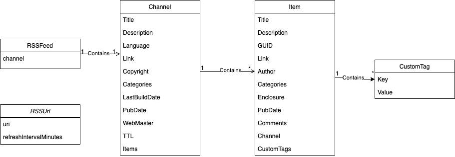

# API

## General

The api makes use of Spring managed beans. It enforces also security and gives a default implementation for the functionalities. The user has the posibility to bring it's own implementation and override the default configuration.

The api supports both RSS and Atom feeds. The data model maps the [RSS](https://en.wikipedia.org/wiki/RSS) data model and supports custom added tags. More details about it in the data model section below. The data manipulation is done thru the jaxb unmarshaller (Java Architecture for XML Binding) provided as a Spring bean. More details about object/xml mapping and how Spring OXM works, can be found [here](https://docs.spring.io/spring-ws/site/reference/html/oxm.html)

## Data Model

- RSS URL class represents a url configuration item. It contains the actual url and the refresh time interval in minutes.
- RSS Feed class represents the main object containing the RSS feed data.
- Channel class contains the RSS channel information
- Item class contains the RSS Item information
-- CustomTag class contains the custom tags specific for each Item. These tags are automatically mapped by the JAXB unmarshaller using a custom XMLAdapter named CustomTagAdapter. The CustomTagAdapter is injected in the JAXB unmarshaller in the bean in the Configuration class.
	

Any XML key in the RSS feed that is not set as attribute in the Item class, will be mapped in the CustomTag class.
The Item class contains the method getSearchValues retrieves all the searchable values. This includes also all the values in the CustomTag class.

## Interfaces

The project offers the following interfaces:

###### RssUrlService
Providing interraction with the RSS URL configurations
- getAll - retrieves all configured RSS URLs
- get - retrieves a specific RSS URL configuration based on the given URL string.
- addOrUpdate - perform add or update of a given RSS URL configuration.
- delete - perform delete of a given RSS URL configuration based on a given URL string.


###### RssReaderService
Providing RSS feed operations
- readFeed - read a given feed. Given URL must already be configured in the system (check that RSSUrl exists is enforced)
- readFeeds - reads all configured RSS URLs
- searchFeeds - search for a given key string (can be word or a phrase)
- readPeriodically - opens a new thread and regularly reads the content for each existing RSS URL configuration. The polling interval is read from the RefreshIntervalMinutes attribute of each RSS URL.

Interfaces are annotated with authorization annotations to enforce security and RBAC. To use any of the features, users must be authenticated. For more administrative actions, admin role is needed: addOrUpdate, delete and readPeriodically.

The default implementation of RssReaderService makes use of RssUrlService bean injected as dependecy.

## Configuration

The configuration class RssAggregatorConfig is used to “bootstrap” the Spring beans. It extends GlobalMethodSecurityConfiguration which enforces the security.


###### Beans

- RssReaderService bean is initialized with the default implementation. As dependencies we autowire the RssUrlService and unmarshaller beans
- RssUrlService bean is initialized with the default implementation which contains provides in-memory persistence of the configuration. By default the bean is initialized with it no configurations in-memory (empty list).
- JAXB Unmarshaller bean is initialized and configured with the custom adapter for the CustomTags.
- AuthenticationManager bean

## Testing

Unit-testing is done with Junit5

## Building

To build the project we can do a 
```sh
mvn clean install
```
